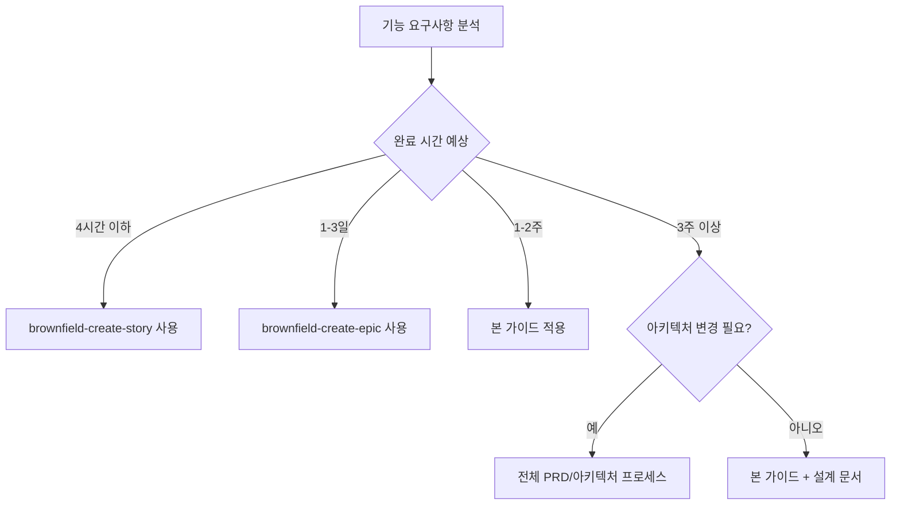

# Brownfield Epic 생성 가이드

## 🏗️ 개요

이 문서는 기존 프로젝트(Brownfield) 환경에서 **TDD 기반의 클린코드 원칙**을 준수하면서 Epic을 생성하는 포괄적인 가이드입니다. **MUST NOT EFFECT TO THE BROWNFIELD CODE** 원칙 하에 기존 기능에 절대 영향을 주지 않으면서 점진적 개선을 수행합니다.

### 핵심 원칙

1. **🔒 기존 코드 무손상** - Brownfield 코드에 절대 영향 없음 [[memory:7535143]]
2. **🧪 TDD 우선** - Red-Green-Refactor 사이클 엄격 준수 [[memory:7535141]]
3. **👥 인간 관점 테스트** - 사용자 관점의 테스트 작성 [[memory:7535139]]
4. **📋 선언적 프로그래밍** - What을 명확히 표현하는 코드 구조
5. **⚡ 점진적 마이그레이션** - 새로운 패턴을 단계별로 도입
6. **🎯 관심사 분리** - 각 레이어의 명확한 책임 분담

## 📊 Epic 규모별 가이드 선택

### 규모 판별 기준

| Epic 규모        | 스토리 수 | 개발 시간 | 적용 가이드                |
| ---------------- | --------- | --------- | -------------------------- |
| **XS (Micro)**   | 1개       | ~4시간    | `brownfield-create-story`  |
| **S (Small)**    | 1-3개     | 1-3일     | `brownfield-create-epic`   |
| **M (Medium)**   | 4-8개     | 1-2주     | 본 가이드 적용             |
| **L (Large)**    | 9-15개    | 3-4주     | 본 가이드 + 아키텍처 설계  |
| **XL (Complex)** | 16개+     | 1개월+    | 전체 PRD/아키텍처 프로세스 |

### 가이드 선택 플로우



## 🎯 Brownfield Epic 생성 프로세스

### 1단계: 프로젝트 현황 분석 (필수)

#### 1.1 기존 시스템 컨텍스트 파악

```markdown
**기존 프로젝트 분석 체크리스트**

- [ ] 프로젝트 목적과 현재 기능 이해
- [ ] 기존 기술 스택 식별
- [ ] 현재 아키텍처 패턴 파악
- [ ] 기존 시스템과의 통합 지점 확인
- [ ] 테스트 전략 및 커버리지 현황 확인
- [ ] 클린코드 위반 패턴 식별 ([[docs/clean-code.md]] 기준)
```

#### 1.2 향상 범위 정의

```markdown
**향상 범위 평가**

- [ ] 향상 사항이 명확히 정의되고 범위가 설정됨
- [ ] 기존 기능에 미치는 영향 평가 완료
- [ ] 필요한 통합 지점 식별
- [ ] 성공 기준 수립
- [ ] TDD 적용 가능성 확인
```

### 2단계: Epic 구조 설계

#### 2.1 TDD 기반 Epic 템플릿

```markdown
# Epic {{Epic번호}}: {{향상 기능명}}

## Epic 개요

### Epic 제목

**{{기능명}} - Brownfield 향상**

### Epic 설명

{{1-2문장으로 Epic이 달성할 목표와 가치 설명}}

### 비즈니스 가치

- {{기존 시스템에 추가되는 가치 1}}
- {{기존 시스템에 추가되는 가치 2}}
- {{기존 시스템에 추가되는 가치 3}}

### 기존 시스템 통합 컨텍스트

**현재 관련 기능**: {{기존 시스템의 관련 기능 간단 설명}}
**기술 스택**: {{관련 기존 기술들}}
**통합 지점**: {{새 작업이 기존 시스템과 연결되는 지점}}

## TDD 전략

### 테스트 우선 접근법 [[memory:7535143]]

1. **Red**: 실패하는 테스트 작성 (기능 명세 역할)
2. **Green**: 테스트를 통과하는 최소한의 코드 작성
3. **Refactor**: 코드 개선 및 클린코드 원칙 적용

### 테스트 레이어 구조

- **단위 테스트**: 유틸리티 및 순수 함수 [[memory:7535141]]
- **통합 테스트**: 시스템 간 상호작용 [[memory:7535141]]
- **인간 관점 테스트**: 사용자 시나리오 기반 [[memory:7535139]]

## Brownfield 호환성 요구사항

### 필수 호환성 체크리스트

- [ ] 기존 API가 변경되지 않음
- [ ] 데이터베이스 스키마 변경이 하위 호환됨
- [ ] UI 변경이 기존 패턴을 따름
- [ ] 성능 영향이 최소화됨
- [ ] 기존 테스트가 모두 통과함

### 리스크 완화 방안

**주요 리스크**: {{기존 시스템에 대한 주요 위험}}
**완화 방안**: {{위험 대응 방법}}
**롤백 계획**: {{변경사항 되돌리기 방법}}

## User Stories (TDD 기반)

### Story {{Epic번호}}.1: {{스토리 제목}}

**Story**: {{사용자 관점에서의 기능 설명}} [[memory:7535139]]

**Priority**: {{Must Have (P0) | Should Have (P1) | Could Have (P2)}}

**TDD 접근법**:

1. **실패 테스트 작성**: {{어떤 테스트를 먼저 작성할지}}
2. **최소 구현**: {{테스트 통과를 위한 최소 코드}}
3. **리팩터링**: {{클린코드 원칙 적용 방향}}

**Acceptance Criteria** (테스트 가능한 형태):

1. {{Given-When-Then 형태의 수용 기준 1}}
2. {{Given-When-Then 형태의 수용 기준 2}}
3. {{기존 기능 무결성 검증 기준}}

**Brownfield 통합 요구사항**: 4. 기존 {{관련 기능}}이 변경되지 않고 계속 작동함 5. 새 기능이 기존 {{패턴}} 패턴을 따름 6. {{시스템/컴포넌트}}와의 통합이 현재 동작을 유지함

**기술적 요구사항**:

- 새로운 컴포넌트/훅: {{목록}}
- API 통합: {{기존 API 활용 방법}}
- 성능 목표: {{구체적 성능 기준}}
- 클린코드 준수: {{적용할 원칙들}}

**Definition of Done** (TDD 관점):

- [ ] 모든 테스트가 Red-Green-Refactor 사이클로 작성됨
- [ ] 기능 요구사항이 테스트로 명세됨
- [ ] 기존 기능 회귀 테스트 통과
- [ ] 통합 요구사항 검증 완료
- [ ] 클린코드 원칙 준수 확인 ([[docs/clean-code.md]] 기준)
- [ ] 코드 리뷰 및 쌍 프로그래밍 완료

### Story {{Epic번호}}.2: {{다음 스토리}}

{{위와 같은 형식으로 반복}}
```

#### 2.2 클린코드 통합 전략

```markdown
## 클린코드 적용 전략

### 선언적 컴포넌트 설계 [[docs/clean-code.md]]

**즉시 변환 대상 패턴**:

- `document.getElementById` → `useRef` + `ref` 속성
- `element.style` 조작 → 조건부 `className` 또는 `style` prop
- 명령형 반복문 → `map/filter/reduce` 선언적 표현
- 조건부 DOM 조작 → JSX 조건부 렌더링

### 금지 패턴 체크리스트 [[docs/clean-code.md]]

**Zero Tolerance 패턴** (발견 시 즉시 수정):

- [ ] `document.getElementById` 사용 없음
- [ ] `document.querySelector` 사용 없음
- [ ] `element.style.property =` 직접 조작 없음
- [ ] `element.innerHTML =` 직접 조작 없음
- [ ] `element.classList.add/remove` 직접 조작 없음

### 아키텍처 레이어 분리 [[docs/react-clean-code-refactoring-architecture.md]]

1. **Presentation Layer**: 순수한 UI 로직만 포함
2. **State Management Layer**: 선언적 상태 관리
3. **Business Logic Layer**: 도메인 로직 (순수 함수)
4. **Data Access Layer**: 저장소 패턴 구현

## 점진적 구현 전략

### Phase 1: 선언적 컴포넌트 분리 (무손상)

- 기존 컴포넌트 유지하면서 새 컴포넌트 병행 구현
- `components-v2/` 디렉토리에 클린코드 컴포넌트 구축
- Feature Flag를 통한 점진적 전환

### Phase 2: 상태 관리 클린코드화

- React Context 기반 선언적 상태 관리
- 기존 훅과의 브릿지 구현
- 상태 로직과 UI 로직 완전 분리

### Phase 3: 비즈니스 로직 분리

- 도메인 엔티티 및 서비스 레이어 구현
- Repository 패턴을 통한 데이터 접근 추상화
- Use Case 패턴으로 비즈니스 로직 캡슐화
```

### 3단계: 검증 및 품질 보증

#### 3.1 Epic 검증 체크리스트

```markdown
**범위 검증**:

- [ ] Epic이 4-8개 스토리로 적절히 구성됨
- [ ] 아키텍처 문서화가 불필요한 수준
- [ ] 향상 사항이 기존 패턴을 따름
- [ ] 통합 복잡도가 관리 가능함

**리스크 평가**:

- [ ] 기존 시스템에 대한 위험이 낮음
- [ ] 롤백 계획이 실행 가능함
- [ ] 테스트 접근법이 기존 기능을 커버함
- [ ] 팀이 통합 지점에 대한 충분한 지식 보유

**TDD 준비도**:

- [ ] 모든 스토리가 테스트 가능한 형태로 작성됨
- [ ] Red-Green-Refactor 사이클 적용 계획 수립
- [ ] 단위/통합 테스트 전략 명확함
- [ ] 인간 관점 테스트 시나리오 정의됨

**완성도 확인**:

- [ ] Epic 목표가 명확하고 달성 가능함
- [ ] 스토리가 적절히 범위 설정됨
- [ ] 성공 기준이 측정 가능함
- [ ] 의존성이 식별됨
- [ ] 클린코드 원칙 적용 계획 수립됨
```

## 🧪 TDD 기반 구현 가이드라인

### 테스트 우선 개발 절차

#### 1. Red Phase (실패하는 테스트)

```typescript
// 1단계: 기능 명세를 테스트로 작성
describe('새로운 기능', () => {
  it('should 원하는 동작을 수행한다', () => {
    // Given: 초기 상태 설정
    const initialState = createInitialState();

    // When: 기능 실행
    const result = executeNewFeature(initialState);

    // Then: 예상 결과 검증
    expect(result).toEqual(expectedResult);
  });
});
```

#### 2. Green Phase (최소 구현)

```typescript
// 2단계: 테스트를 통과하는 최소한의 코드
export const executeNewFeature = (state: State): Result => {
  // 가장 간단한 방법으로 테스트 통과
  return basicImplementation(state);
};
```

#### 3. Refactor Phase (클린코드 적용)

```typescript
// 3단계: 클린코드 원칙 적용하여 리팩터링
export const executeNewFeature = (state: State): Result => {
  // 선언적 방식으로 개선
  return pipe(validateInput, transformData, applyBusinessLogic, formatOutput)(state);
};
```

### 테스트 레이어별 가이드라인

#### 단위 테스트 (유틸리티 및 순수 함수) [[memory:7535141]]

```typescript
// 순수 함수에 대한 철저한 테스트
describe('dateUtils', () => {
  describe('calculateRecurringDates', () => {
    it('should handle monthly recurrence correctly', () => {
      const startDate = '2024-01-31';
      const recurrence = { type: 'monthly', count: 3 };

      const result = calculateRecurringDates(startDate, recurrence);

      expect(result).toEqual(['2024-01-31', '2024-03-31', '2024-05-31']);
    });
  });
});
```

#### 통합 테스트 (시스템 간 상호작용) [[memory:7535141]]

```typescript
// 컴포넌트와 훅의 통합 테스트
describe('EventCreation Integration', () => {
  it('should create recurring events through complete flow', async () => {
    const { result } = renderHook(() => useEventOperations());

    await act(async () => {
      await result.current.createRecurringEvent(eventData);
    });

    expect(mockEventRepository.save).toHaveBeenCalledWith(
      expect.arrayContaining([expect.objectContaining({ repeat: { type: 'weekly' } })])
    );
  });
});
```

#### 인간 관점 테스트 (사용자 시나리오) [[memory:7535139]]

```typescript
// 사용자 관점에서의 E2E 테스트
describe('Recurring Event User Journey', () => {
  it('사용자가 주간 반복 일정을 생성할 수 있다', async () => {
    // 사용자가 일정 폼을 연다
    await user.click(screen.getByRole('button', { name: '일정 추가' }));

    // 사용자가 반복 설정을 활성화한다
    await user.click(screen.getByLabelText('반복 일정'));

    // 사용자가 주간 반복을 선택한다
    await user.selectOptions(screen.getByLabelText('반복 유형'), 'weekly');

    // 사용자가 일정을 저장한다
    await user.click(screen.getByRole('button', { name: '저장' }));

    // 반복 일정이 캘린더에 표시된다
    expect(screen.getAllByTestId('recurring-event')).toHaveLength(4);
  });
});
```

## 📋 Epic 템플릿 및 체크리스트

### 완성된 Epic 템플릿

````markdown
# Epic {{번호}}: {{기능명}} - Brownfield Enhancement

## 📋 Epic 메타정보

- **생성일**: {{YYYY-MM-DD}}
- **예상 기간**: {{X주}}
- **복잡도**: {{Medium (M)}}
- **TDD 적용**: ✅ 필수
- **클린코드 준수**: ✅ 필수

## 🎯 Epic 개요

### Epic 제목

**{{기능명}} - Brownfield 클린코드 향상**

### Epic 목표

{{1-2문장으로 이 Epic이 달성할 구체적 목표와 가치}}

### 비즈니스 가치

- **기존 시스템 개선**: {{어떤 기존 기능이 어떻게 개선되는지}}
- **사용자 경험 향상**: {{사용자에게 제공되는 새로운 가치}}
- **기술적 부채 해결**: {{해결되는 기술적 문제들}}
- **미래 확장성**: {{향후 개발에 미치는 긍정적 영향}}

### 성공 지표

- {{측정 가능한 성공 기준 1}}
- {{측정 가능한 성공 기준 2}}
- {{측정 가능한 성공 기준 3}}

## 🏗️ 기존 시스템 컨텍스트

### 현재 시스템 상태

**기존 관련 기능**: {{기존 시스템의 관련 기능 설명}}
**기술 스택**: {{관련 기존 기술 스택}}
**아키텍처 패턴**: {{현재 사용 중인 패턴들}}
**통합 지점**: {{새 기능이 연결될 지점들}}

### 클린코드 현황 분석 [[docs/clean-code.md]]

**발견된 안티패턴**:

- [ ] DOM 직접 조작 (`document.getElementById` 등)
- [ ] 명령형 반복문 (JSX 생성하는 `for`문)
- [ ] 조건부 DOM 조작 (`element.style` 변경)
- [ ] 클래스/스타일 직접 조작

**적용할 선언적 패턴**:

- [ ] `useRef` + JSX ref 속성
- [ ] `map/filter/reduce` 선언적 표현
- [ ] 조건부 렌더링 (`{condition && <Component />}`)
- [ ] 조건부 className (`className={isActive ? 'active' : ''}`)

## 🧪 TDD 전략

### 테스트 우선 개발 계획

1. **Red Phase**: 각 스토리별 실패 테스트 먼저 작성
2. **Green Phase**: 테스트 통과하는 최소 구현
3. **Refactor Phase**: 클린코드 원칙 적용

### 테스트 레이어 구조 [[memory:7535141]]

**단위 테스트**: 순수 함수 및 유틸리티

- 비즈니스 로직 함수
- 날짜/시간 계산 로직
- 데이터 변환 함수

**통합 테스트**: 컴포넌트 간 상호작용

- 훅과 컴포넌트 연동
- API 호출 및 상태 관리
- 라우팅 및 네비게이션

**인간 관점 테스트**: 사용자 시나리오 [[memory:7535139]]

- 완전한 사용자 여정
- 에러 상황 및 복구
- 접근성 및 사용성

## 🔒 Brownfield 호환성 요구사항

### 필수 호환성 체크리스트

- [ ] **API 호환성**: 기존 API 엔드포인트가 변경되지 않음
- [ ] **데이터 호환성**: 데이터베이스 스키마 변경이 하위 호환됨
- [ ] **UI 호환성**: UI 변경이 기존 디자인 시스템을 따름
- [ ] **성능 호환성**: 기존 성능 지표가 유지됨
- [ ] **테스트 호환성**: 기존 모든 테스트가 통과함

### 리스크 완화 전략

**주요 리스크**: {{기존 시스템에 대한 주요 위험 요소}}
**완화 방안**: {{위험을 줄이는 구체적 방법}}
**롤백 계획**: {{문제 발생 시 되돌리는 방법}}
**모니터링**: {{변경사항 모니터링 방법}}

## 📖 User Stories

### Story {{Epic번호}}.1: {{첫 번째 스토리 제목}}

**User Story** [[memory:7535139]]:
As a {{사용자 유형}},
I want {{원하는 기능}},
So that {{얻고자 하는 가치}}.

**Priority**: Must Have (P0)

**TDD 접근법**:

1. **Red**: {{실패하는 테스트 시나리오}}
2. **Green**: {{최소 구현 방향}}
3. **Refactor**: {{클린코드 적용 계획}}

**Acceptance Criteria** (Given-When-Then 형태):

1. **Given** {{초기 상태}}, **When** {{액션}}, **Then** {{예상 결과}}
2. **Given** {{조건}}, **When** {{사용자 입력}}, **Then** {{시스템 응답}}
3. **Given** {{기존 데이터}}, **When** {{새 기능 실행}}, **Then** {{무결성 유지}}

**Brownfield 통합 요구사항**: 4. 기존 {{관련 기능}}이 변경되지 않고 계속 작동함 5. 새 기능이 기존 {{패턴}} 패턴을 따름 6. {{시스템/컴포넌트}}와의 통합이 현재 동작을 유지함

**기술적 요구사항**:

- **새 컴포넌트/훅**: {{목록}}
- **API 통합**: {{사용할 기존 API}}
- **성능 목표**: {{구체적 성능 기준}}
- **클린코드 준수**: {{적용할 원칙들}}

**Definition of Done**:

- [ ] 모든 테스트가 Red-Green-Refactor 사이클로 작성됨
- [ ] 기능이 테스트로 완전히 명세됨
- [ ] 기존 기능 회귀 테스트 통과
- [ ] 클린코드 원칙 준수 확인 ([[docs/clean-code.md]] 기준)
- [ ] 통합 요구사항 검증 완료
- [ ] 코드 리뷰 및 페어 프로그래밍 완료

### Story {{Epic번호}}.2: {{두 번째 스토리}}

{{위와 같은 구조로 반복}}

## 🏗️ 아키텍처 및 설계

### 클린코드 적용 전략 [[docs/react-clean-code-refactoring-architecture.md]]

#### Phase 1: 선언적 컴포넌트 분리

```typescript
// 기존 컴포넌트 유지하면서 새 컴포넌트 병행
src/
├── components/           # 기존 컴포넌트 (유지)
├── components-v2/        # 새로운 클린코드 컴포넌트
│   ├── declarative/      # 선언적 컴포넌트
│   ├── atomic/          # 원자 수준 컴포넌트
│   └── composite/       # 합성 컴포넌트
```
````

#### Phase 2: 상태 관리 클린코드화

```typescript
src/
├── state/               # 새로운 상태 관리
│   ├── contexts/        # React Context
│   ├── stores/          # 상태 저장소
│   ├── selectors/       # 선택자 패턴
│   └── actions/         # 액션 정의
```

#### Phase 3: 비즈니스 로직 분리

```typescript
src/
├── domain/              # 도메인 레이어
│   ├── entities/        # 엔티티
│   ├── repositories/    # 저장소 패턴
│   ├── services/        # 도메인 서비스
│   └── usecases/        # 유스케이스
```

### 점진적 마이그레이션 전략

1. **Feature Flag 활용**: 새/구 컴포넌트 병행
2. **브릿지 패턴**: 기존 훅과 새 상태 관리 연결
3. **단계적 전환**: 컴포넌트별 선택적 교체

## 🧪 테스트 전략

### 테스트 커버리지 목표

- **단위 테스트**: 95% 이상
- **통합 테스트**: 모든 주요 플로우
- **E2E 테스트**: 핵심 사용자 시나리오

### TDD 사이클 적용 [[memory:7535143]]

```typescript
// 1. Red: 실패하는 테스트 작성
describe('새로운 기능', () => {
  it('should 원하는 동작을 한다', () => {
    expect(newFeature()).toBeDefined();
  });
});

// 2. Green: 최소 구현
const newFeature = () => {
  return '기본 구현';
};

// 3. Refactor: 클린코드 적용
const newFeature = pipe(validateInput, transformData, executeLogic);
```

### 인간 관점 테스트 예시 [[memory:7535139]]

```typescript
describe('사용자 여정: 새 기능 사용', () => {
  it('사용자가 새 기능을 성공적으로 사용할 수 있다', async () => {
    // 사용자가 기능에 접근
    await user.click(screen.getByRole('button', { name: '새 기능' }));

    // 사용자가 필요한 정보를 입력
    await user.type(screen.getByLabelText('입력 필드'), '테스트 값');

    // 사용자가 기능을 실행
    await user.click(screen.getByRole('button', { name: '실행' }));

    // 사용자가 예상하는 결과를 확인
    expect(screen.getByText('성공적으로 완료되었습니다')).toBeInTheDocument();
  });
});
```

## 📈 성능 및 품질 지표

### 성능 목표

- **로딩 시간**: 기존 대비 성능 저하 없음
- **메모리 사용**: 20% 이내 증가
- **번들 크기**: 최소 증가
- **렌더링 성능**: 60fps 유지

### 품질 지표

- **코드 복잡도**: 평균 4 이하
- **테스트 커버리지**: 95% 이상
- **타입 안전성**: 100% TypeScript
- **접근성 점수**: AA 등급 이상

## 🚀 구현 타임라인

### Week 1: 기반 설정 및 첫 번째 스토리

- [ ] 프로젝트 분석 및 설계 완료
- [ ] TDD 환경 설정
- [ ] Story 1 구현 (Red-Green-Refactor)

### Week 2: 핵심 기능 구현

- [ ] Story 2-3 구현
- [ ] 통합 테스트 작성
- [ ] 성능 최적화

### Week 3: 마무리 및 통합

- [ ] 남은 스토리 완료
- [ ] E2E 테스트 작성
- [ ] 문서화 및 배포 준비

## ✅ 완료 기준

### Epic 성공 기준

- [ ] 모든 스토리의 Acceptance Criteria 충족
- [ ] 기존 기능 100% 무결성 유지
- [ ] TDD 사이클로 모든 코드 작성 완료
- [ ] 클린코드 원칙 준수 확인
- [ ] 성능 지표 목표 달성
- [ ] 사용자 시나리오 테스트 통과

### 품질 보증

- [ ] 모든 테스트 통과 (단위/통합/E2E)
- [ ] 코드 리뷰 완료
- [ ] 보안 검토 완료
- [ ] 접근성 검증 완료
- [ ] 크로스 브라우저 테스트 완료

## 📚 Dependencies 및 참고자료

### 선행 조건

- [ ] 기존 시스템 분석 완료
- [ ] 개발 환경 TDD 지원 설정
- [ ] 팀 TDD 역량 확보

### 외부 의존성

- {{필요한 라이브러리 목록}}
- {{API 또는 서비스 의존성}}
- {{인프라 또는 도구 요구사항}}

### 참고 문서

- [[docs/clean-code.md]]: 클린코드 원칙 및 변환 규칙
- [[docs/react-clean-code-refactoring-architecture.md]]: 아키텍처 가이드
- [[docs/tdd-code-of-conduct.md]]: TDD 행동강령 [[memory:7535143]]

## 🎯 스토리 관리자 인수인계

Epic 검증 완료 후 다음 정보를 스토리 관리자에게 전달:

**스토리 관리자 인수인계**:

"이 Brownfield Epic의 상세 스토리 개발을 요청합니다. 주요 고려사항:

- **기존 시스템**: {{기술 스택}} 환경에서 실행 중
- **통합 지점**: {{주요 통합 지점 목록}}
- **준수할 패턴**: {{기존 패턴들}}
- **필수 호환성**: {{핵심 요구사항}}
- **TDD 필수**: 모든 스토리는 Red-Green-Refactor 사이클 적용
- **클린코드 적용**: [[docs/clean-code.md]] 원칙 엄격 준수
- **각 스토리는 기존 기능 무결성 검증 포함 필수**

Epic 목표는 {{Epic 목표}}이며, 시스템 무결성을 유지하면서 클린코드 원칙을 통한 점진적 개선입니다."

---

## 🔄 Epic 후속 작업

### 다음 Epic 준비

- [ ] 현재 Epic 학습사항 정리
- [ ] 개선된 패턴 문서화
- [ ] 다음 우선순위 기능 식별

### 지속적 개선

- [ ] 메트릭 모니터링 설정
- [ ] 사용자 피드백 수집
- [ ] 기술적 부채 추가 식별
- [ ] 팀 TDD 역량 강화 계획

````

### 실무 적용 체크리스트

#### Epic 생성 전 필수 확인사항
```markdown
**🔍 Epic 생성 준비 체크리스트**

**프로젝트 분석**:
- [ ] 기존 코드베이스 구조 파악 완료
- [ ] 현재 기술 스택 및 패턴 분석 완료
- [ ] 클린코드 위반 패턴 식별 완료 ([[docs/clean-code.md]] 기준)
- [ ] 기존 테스트 현황 및 커버리지 확인
- [ ] 성능 베이스라인 측정 완료

**TDD 준비**:
- [ ] 개발 환경에 TDD 도구 설정 완료
- [ ] 팀 TDD 역량 평가 및 교육 계획 수립
- [ ] 테스트 전략 및 구조 합의
- [ ] CI/CD 파이프라인에 테스트 통합

**Epic 범위 검증**:
- [ ] 기능 요구사항이 4-8개 스토리로 분해 가능
- [ ] 예상 개발 기간이 1-3주 내
- [ ] 아키텍처 변경이 최소한으로 제한됨
- [ ] 기존 시스템 영향도가 낮거나 관리 가능

**리스크 평가**:
- [ ] 주요 위험 요소 식별 및 완화 방안 수립
- [ ] 롤백 계획 수립
- [ ] 모니터링 및 알림 체계 준비
- [ ] 장애 대응 프로세스 확인
````

#### Epic 품질 검증 체크리스트

```markdown
**📊 Epic 품질 검증 체크리스트**

**구조적 완성도**:

- [ ] Epic 목표가 명확하고 측정 가능함
- [ ] 모든 스토리가 INVEST 원칙을 충족함
- [ ] Acceptance Criteria가 Given-When-Then 형태로 작성됨
- [ ] Definition of Done이 구체적이고 검증 가능함

**TDD 적용도**:

- [ ] 각 스토리별 TDD 접근법이 명시됨
- [ ] 테스트 레이어(단위/통합/E2E) 전략이 명확함
- [ ] 인간 관점 테스트 시나리오가 포함됨 [[memory:7535139]]
- [ ] Red-Green-Refactor 사이클 계획이 수립됨

**클린코드 준수도**:

- [ ] 금지 패턴 제거 계획이 수립됨 ([[docs/clean-code.md]])
- [ ] 선언적 패턴 적용 방안이 명시됨
- [ ] 관심사 분리 전략이 포함됨
- [ ] 점진적 리팩터링 계획이 수립됨

**Brownfield 호환성**:

- [ ] 기존 API 호환성 보장 방안 명시
- [ ] 데이터 마이그레이션 계획 수립 (필요시)
- [ ] 기존 테스트 영향도 분석 완료
- [ ] 성능 영향 최소화 방안 수립

**문서화 품질**:

- [ ] 기술적 컨텍스트가 충분히 설명됨
- [ ] 비즈니스 가치가 명확히 표현됨
- [ ] 의존성 및 제약사항이 명시됨
- [ ] 성공 기준이 구체적으로 정의됨
```

## 🎯 실제 적용 사례

### 사례 연구: 반복 일정 기능 Epic

프로젝트의 실제 Epic 2 ([[docs/stories/epic-2-recurring-events-core.md]])를 통해 본 가이드의 적용 사례를 살펴보겠습니다.

#### 사례 분석: 성공 요소

**✅ 잘 적용된 부분**:

- Epic 목표가 명확함: "반복 일정 핵심 기능 구현"
- 비즈니스 가치가 구체적으로 명시됨
- 성공 지표가 측정 가능함 (반복 일정 생성 성공률 95% 등)
- 4개의 적절한 스토리로 구성됨
- 기술적 요구사항이 상세히 기술됨

**🔄 본 가이드 기준으로 개선 가능한 부분**:

```markdown
**TDD 적용 강화 방안**:

- [ ] 각 스토리별 Red-Green-Refactor 사이클 명시 필요
- [ ] 인간 관점 테스트 시나리오 추가 필요 [[memory:7535139]]
- [ ] 테스트 레이어별 전략 구체화 필요

**클린코드 원칙 적용**:

- [ ] 기존 DOM 조작 패턴 식별 및 변환 계획 수립
- [ ] 선언적 컴포넌트 설계 가이드라인 추가
- [ ] 점진적 리팩터링 전략 명시

**Brownfield 호환성 강화**:

- [ ] 기존 캘린더 컴포넌트와의 통합 방안 구체화
- [ ] 기존 API 호환성 보장 전략 명시
- [ ] 롤백 계획 상세화
```

#### 개선된 스토리 예시

**기존 Story 2.1** vs **개선된 버전**:

```markdown
## 기존 버전 (Epic 2)

### Story 2.1: 반복 일정 생성

**Story**: 캘린더 사용자로서, 반복 유형과 종료 조건을 설정하여 반복 일정을 생성할 수 있어서, 반복되는 일정을 매번 입력하지 않아도 된다.

## 본 가이드 적용 개선 버전

### Story 2.1: 반복 일정 생성 - TDD 기반 클린코드 구현

**User Story** [[memory:7535139]]:
As a 캘린더 사용자,
I want 반복 유형(매일/매주/매월/매년)과 종료 조건을 설정하여 반복 일정을 생성할 수 있기를,
So that 반복되는 일정을 매번 수동으로 입력하지 않고 자동화할 수 있다.

**TDD 접근법**:

1. **Red**: 반복 일정 생성 API 호출 실패 테스트 작성
2. **Green**: 기본 반복 일정 생성 로직 구현
3. **Refactor**: 선언적 컴포넌트로 리팩터링, DOM 조작 제거

**Acceptance Criteria** (Given-When-Then):

1. **Given** 사용자가 일정 생성 폼에 있고, **When** 반복 옵션을 활성화하고 '매주' 선택 후 저장하면, **Then** 주간 반복 일정들이 생성되어 캘린더에 표시된다
2. **Given** 사용자가 31일 매월 반복을 설정하고, **When** 일정을 생성하면, **Then** 31일이 없는 달은 건너뛰고 정확히 31일에만 일정이 생성된다
3. **Given** 기존 단일 일정들이 있고, **When** 새 반복 일정을 생성하면, **Then** 기존 일정들은 영향받지 않고 그대로 유지된다

**Brownfield 통합 요구사항**: 4. 기존 `EventForm` 컴포넌트가 변경되지 않고 계속 작동함 5. 새 반복 기능이 기존 이벤트 생성 패턴을 따름 6. 기존 `useEventOperations` 훅과의 통합이 현재 동작을 유지함

**클린코드 적용 계획**:

- **금지 패턴 제거**: `document.getElementById` 사용 금지
- **선언적 패턴 적용**: 조건부 렌더링으로 반복 UI 구현
- **컴포넌트 분리**: `RecurringEventForm` 별도 컴포넌트 생성
- **상태 관리**: 선언적 상태 관리로 반복 설정 처리

**Definition of Done** (TDD 강화):

- [ ] 반복 날짜 계산 로직이 TDD로 구현됨 (Red-Green-Refactor)
- [ ] 반복 UI 컴포넌트가 선언적 방식으로 구현됨
- [ ] 기존 기능 회귀 테스트 100% 통과
- [ ] 인간 관점 E2E 테스트 시나리오 통과 [[memory:7535139]]
- [ ] 클린코드 원칙 준수 확인 ([[docs/clean-code.md]] 기준)
```

### 가이드 적용 시 주의사항

#### 흔한 실수와 해결방안

**❌ 실수 1: TDD 없이 구현 시작**

```markdown
**문제**: 기능 구현을 먼저 하고 나중에 테스트 작성
**해결**: 반드시 실패하는 테스트부터 작성 [[memory:7535143]]
**예시**:
// ❌ 잘못된 접근
const createRecurringEvent = () => { /_ 구현 먼저 _/ };

// ✅ 올바른 접근
describe('createRecurringEvent', () => {
it('should generate weekly recurring dates', () => {
// 먼저 테스트 작성, 당연히 실패
expect(createRecurringEvent()).toEqual([]);
});
});
```

**❌ 실수 2: 기존 코드 변경으로 인한 부작용**

```markdown
**문제**: 기존 컴포넌트를 직접 수정하여 예상치 못한 사이드 이펙트 발생
**해결**: 새 컴포넌트 생성 후 점진적 교체
**예시**:
// ❌ 기존 EventForm.tsx 직접 수정
// ✅ EventFormV2.tsx 새로 생성 후 Feature Flag로 전환
```

**❌ 실수 3: 클린코드 원칙 무시**

```markdown
**문제**: DOM 직접 조작 패턴 유지
**해결**: [[docs/clean-code.md]] 원칙 엄격 준수
**예시**:
// ❌ 금지 패턴
document.getElementById('calendar').innerHTML = generateHTML();

// ✅ 선언적 패턴
return (
<Calendar>
{events.map(event => <Event key={event.id} {...event} />)}
</Calendar>
);
```

## 🎓 팀 적용 가이드라인

### 팀 온보딩 프로세스

#### 1주차: 기본 개념 이해

- [ ] TDD 기본 원칙 교육 [[memory:7535143]]
- [ ] 클린코드 원칙 학습 ([[docs/clean-code.md]])
- [ ] Brownfield 리팩터링 전략 이해
- [ ] 본 가이드 전체 리뷰 및 질의응답

#### 2주차: 실습 및 적용

- [ ] 간단한 기능으로 TDD 연습
- [ ] 기존 코드의 클린코드 위반 패턴 식별 실습
- [ ] 첫 번째 Epic 생성 실습 (멘토와 함께)
- [ ] 코드 리뷰 및 페어 프로그래밍 경험

#### 3주차: 독립적 적용

- [ ] 개별 Epic 생성 및 구현
- [ ] 팀 리뷰 및 피드백
- [ ] 프로세스 개선 제안
- [ ] 다음 Epic 계획 수립

### 품질 관리 프로세스

#### Epic 리뷰 체크포인트

```markdown
**Epic 승인 전 필수 리뷰**:

- [ ] Epic 구조 검토 (PM + 아키텍트)
- [ ] TDD 계획 검증 (시니어 개발자)
- [ ] 클린코드 적용 방안 확인 (코드 리뷰어)
- [ ] Brownfield 영향도 평가 (팀 리드)

**스토리 구현 중 체크포인트**:

- [ ] Red-Green-Refactor 사이클 준수 확인
- [ ] 기존 테스트 회귀 없음 확인
- [ ] 코드 리뷰에서 클린코드 원칙 준수 확인
- [ ] 성능 영향 모니터링
```

## 📈 성공 지표 및 모니터링

### Epic 수준 지표

#### 정량적 지표

- **개발 속도**: Epic 완료 시간 (목표: 예상 시간 ±20%)
- **품질 지표**: 버그 발생률 (목표: Epic당 2개 이하)
- **테스트 커버리지**: 코드 커버리지 (목표: 95% 이상)
- **성능 영향**: 기존 성능 유지 (목표: ±5% 이내)

#### 정성적 지표

- **팀 만족도**: 개발 경험 개선 정도
- **코드 품질**: 리뷰어 피드백 점수
- **유지보수성**: 후속 기능 개발 용이성
- **학습 효과**: 팀 TDD/클린코드 역량 향상

### 지속적 개선 프로세스

#### 회고 및 개선

```markdown
**Epic 완료 후 회고 항목**:

- [ ] TDD 적용에서 어려웠던 점과 해결 방법
- [ ] 클린코드 원칙 적용 중 발견한 패턴들
- [ ] Brownfield 통합에서 예상치 못한 이슈들
- [ ] 다음 Epic에 적용할 개선사항들

**가이드 업데이트**:

- [ ] 새로 발견한 베스트 프랙티스 추가
- [ ] 문제가 된 패턴들 안티패턴 섹션에 추가
- [ ] 팀 피드백을 바탕으로 가이드 개선
- [ ] 성공 사례 및 실패 사례 문서화
```

## 🔄 가이드 버전 관리

### 변경 이력

- **v1.0** (2024-12): 초기 버전 - TDD 기반 Brownfield Epic 생성 가이드
- **v1.1** (예정): 팀 피드백 반영 및 실제 적용 사례 추가

### 지속적 업데이트 계획

- [ ] 분기별 팀 피드백 수집 및 반영
- [ ] 새로운 클린코드 패턴 발견 시 업데이트
- [ ] 기술 스택 변화에 따른 가이드 조정
- [ ] 다른 프로젝트 적용 사례 수집 및 일반화

---

## 📚 마무리

이 Brownfield Epic 생성 가이드는 기존 프로젝트의 점진적 개선을 위한 포괄적인 프레임워크를 제공합니다. **TDD 우선 개발** [[memory:7535143]], **클린코드 원칙 준수**, **기존 시스템 무손상** 원칙을 바탕으로 안전하고 체계적인 개선을 가능하게 합니다.

### 핵심 기억사항

1. **테스트가 먼저** - 모든 기능은 실패하는 테스트부터 시작
2. **기존 코드 보호** - 변경사항이 기존 기능에 영향 없음 보장
3. **점진적 개선** - 한 번에 큰 변화보다 작은 단계들의 누적
4. **인간 중심 테스트** - 사용자 관점에서 생각하고 테스트 작성 [[memory:7535139]]
5. **선언적 사고** - What에 집중하고 How는 구현체에 위임

성공적인 Epic 실행을 통해 더 나은 코드베이스와 개발 문화를 만들어 나가시기 바랍니다.

<function_calls>
<invoke name="todo_write">
<parameter name="merge">true
