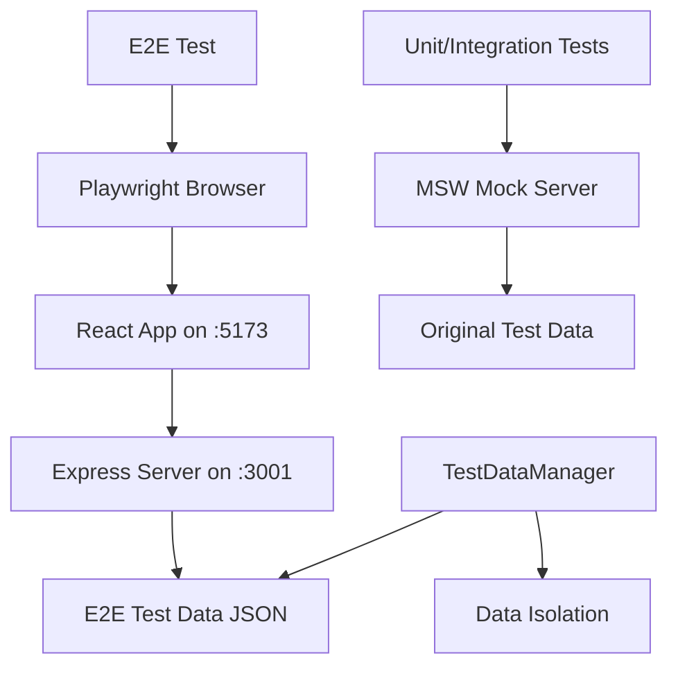

# Playwright E2E 테스트 - Brownfield Enhancement Architecture

## Introduction

이 문서는 기존 일정 관리 애플리케이션에 **Playwright를 사용한 극소부분의 E2E 테스트**를 추가하는 아키텍처를 정의합니다.

현재 97%+ 커버리지의 Vitest + Testing Library 기반 유닛/통합 테스트 환경을 유지하면서, 핵심 사용자 시나리오에 대한 E2E 테스트만을 선별적으로 도입하는 것이 목표입니다.

**주요 설계 원칙:**

- 기존 테스트 환경과의 완전한 분리 및 호환성 유지
- 최소한의 설정으로 최대 효과 달성
- 유지보수 부담 최소화
- 명확하고 단순한 구조

**Relationship to Existing Architecture:**
이 문서는 기존 프로젝트 아키텍처를 보완하며, 새로운 E2E 테스트 환경이 현재 시스템과 어떻게 통합되는지 정의합니다. 기존 패턴과 충돌하지 않으면서 브라우저 환경에서만 검증 가능한 시나리오를 다룹니다.

## Existing Project Analysis

### Current Project State

- **Primary Purpose:** 반복 일정 기능이 포함된 고급 캘린더 관리 시스템
- **Current Tech Stack:** React 19.1.0 + TypeScript 5.2.2 + Material-UI 7.2.0 + Vite 7.0.2
- **Architecture Style:** Custom Hooks 기반 상태 관리, 컴포넌트 기반 아키텍처, 유틸리티 함수 분리
- **Deployment Method:** Vite 개발 서버 (포트 5173) + Express.js 백엔드 (포트 3000)

### Available Documentation

- **Architecture.md:** 반복 일정 기능 추가를 위한 기존 Brownfield 아키텍처
- **calendar-complete-prd.md:** 완전한 제품 요구사항 명세서
- **Epic 스토리들:** 4개 Epic, 25개+ 상세 스토리
- **QA 문서:** 8개 게이트 테스트 + 5개 상세 리뷰
- **TDD 가이드라인:** tdd-code-of-conduct.md
- **기존 테스트:** 235개 테스트 케이스, 97%+ 커버리지

### Identified Constraints

- **기존 테스트 무간섭:** 97% 커버리지의 기존 테스트에 전혀 영향주지 않음
- **JSON 파일 저장소:** 실제 데이터베이스 없이 파일 기반 저장, 테스트 데이터 격리 필요
- **서드파티 라이브러리:** overlay-kit, Material-UI 등 실제 브라우저 환경에서만 검증 가능
- **복잡한 사용자 플로우:** 다이얼로그 → 상태 변경 → API → UI 동기화 등 멀티스텝 플로우

### Change Log

| Change                 | Date       | Version | Description                                  | Author              |
| ---------------------- | ---------- | ------- | -------------------------------------------- | ------------------- |
| 초기 E2E 아키텍처 설계 | 2024-12-19 | 1.0     | Playwright 기반 극소부분 E2E 테스트 아키텍처 | Winston (Architect) |

## Enhancement Scope and Integration Strategy

### Enhancement Overview

**Enhancement Type:** 기존 테스트 스위트 보완 (Test Suite Augmentation)
**Scope:** 극소부분 Critical Path E2E 테스트 (4개 핵심 시나리오)
**Integration Impact:** 최소 침습적 (Minimally Invasive)

### Integration Approach

**Code Integration Strategy:** 병렬 공존 (Parallel Coexistence)

- 기존 Vitest 테스트 환경과 완전 분리
- 별도 package.json 스크립트로 독립 실행
- 새로운 tests/e2e/ 디렉토리에 격리

**Database Integration:** 실제 서버 환경 사용

- 기존 MSW 모킹: 유닛/통합 테스트에서 계속 사용
- E2E 실제 서버: Express.js 서버(포트 3001) + 분리된 테스트 데이터
- 테스트 데이터 완전 격리: e2e-events.json 별도 파일

**API Integration:** 실제 REST API 호출

- 기존 API 엔드포인트 그대로 사용
- 환경변수로 데이터 파일 분기 처리
- 새로운 API 변경 없음

**UI Integration:** 실제 브라우저 환경

- Chromium 헤드리스 모드로 실행
- 실제 Material-UI 렌더링 검증
- overlay-kit 다이얼로그 상호작용 테스트

### Compatibility Requirements

- **Existing API Compatibility:** 100% 호환성 유지, 기존 API 엔드포인트 그대로 사용
- **Database Schema Compatibility:** 기존 JSON 데이터 구조 유지, 테스트용 파일만 분리
- **UI/UX Consistency:** 기존 사용자 경험 무변경, Material-UI 컴포넌트 스타일 유지
- **Performance Impact:** 기존 애플리케이션 성능에 영향 없음, 별도 환경에서 실행

## Tech Stack Alignment

### Existing Technology Stack

| Category               | Current Technology | Version | Usage in Enhancement         | Notes                           |
| ---------------------- | ------------------ | ------- | ---------------------------- | ------------------------------- |
| **Frontend Framework** | React              | 19.1.0  | E2E 테스트 대상              | 최신 버전, Playwright 완벽 지원 |
| **Build Tool**         | Vite               | 7.0.2   | 개발 서버 (포트 5173)        | E2E 테스트에서 빌드된 앱 테스트 |
| **Testing Framework**  | Vitest             | 3.2.4   | 기존 유닛/통합 테스트 유지   | Playwright와 병렬 실행          |
| **Test Utilities**     | Testing Library    | 16.3.0  | 유닛 테스트에서 계속 사용    | E2E에서는 직접 DOM 조작         |
| **API Mocking**        | MSW                | 2.10.3  | 유닛 테스트용                | E2E는 실제 서버 사용            |
| **UI Framework**       | Material-UI        | 7.2.0   | E2E에서 실제 컴포넌트 테스트 | data-testid 활용                |
| **Modal/Dialog**       | overlay-kit        | 1.8.4   | E2E 핵심 테스트 대상         | 실제 브라우저에서만 테스트 가능 |
| **Backend**            | Express.js         | latest  | E2E 테스트 서버              | 별도 포트(3001)에서 실행        |
| **TypeScript**         | TypeScript         | 5.2.2   | E2E 테스트 타입 안전성       | 기존 타입 재사용                |

### New Technology Additions

| Technology           | Version | Purpose                     | Rationale         | Integration Method            |
| -------------------- | ------- | --------------------------- | ----------------- | ----------------------------- |
| **@playwright/test** | ^1.40.0 | E2E 테스트 프레임워크       | 업계 표준, 안정적 | 별도 설치, 기존 테스트와 분리 |
| **cross-env**        | ^7.0.3  | 환경변수 크로스 플랫폼 설정 | E2E 환경 구성     | 테스트 스크립트용             |

## Data Models and Schema Changes

### 기존 데이터 모델 유지

E2E 테스트는 기존 데이터 모델을 그대로 사용하며, 새로운 스키마 변경은 없습니다.

**Event 타입 (기존 유지):**

```typescript
export interface Event {
  id: string;
  title: string;
  date: string;
  startTime: string;
  endTime: string;
  description: string;
  location: string;
  category: string;
  repeat: RepeatInfo;
  notificationTime: number;
}
```

### Schema Integration Strategy

**Database Changes Required:**

- **New Tables:** 없음
- **Modified Tables:** 없음
- **New Indexes:** 없음
- **Migration Strategy:** 데이터 파일 분리만 수행

**Backward Compatibility:**

- 기존 realEvents.json 구조 100% 유지
- E2E 전용 테스트 데이터는 tests/fixtures/e2e-events.json에 분리
- 환경변수로 데이터 파일 분기 처리

## Component Architecture

### 새로운 컴포넌트 없음

E2E 테스트는 기존 컴포넌트를 그대로 테스트하며, 새로운 React 컴포넌트를 추가하지 않습니다.

### E2E 테스트 구조

**TestDataManager**

- **Responsibility:** E2E 테스트 데이터 격리 및 관리
- **Integration Points:** Express.js 서버와 JSON 파일 시스템

**Key Interfaces:**

- setupCleanState(): 테스트 시작 전 깨끗한 데이터 상태 설정
- cleanup(): 테스트 완료 후 데이터 정리

**Dependencies:**

- **Existing Components:** 모든 기존 React 컴포넌트
- **New Components:** 없음

**Technology Stack:** Node.js 파일 시스템 API, 환경변수 관리

### Component Interaction Diagram



## Source Tree Integration

### Existing Project Structure

```
front_6th_chapter3-2/
├── src/
│   ├── components/           # 기존 React 컴포넌트들
│   ├── hooks/               # 기존 커스텀 훅들
│   ├── utils/               # 기존 유틸리티 함수들
│   ├── __tests__/           # 기존 유닛/통합 테스트 (235개)
│   └── __mocks__/
│       └── response/
│           └── realEvents.json  # 기존 테스트 데이터
├── docs/                    # 기존 문서들
├── server.js               # Express.js 서버
├── package.json            # 기존 의존성들
└── vite.config.ts         # 기존 Vite 설정
```

### New File Organization

```
front_6th_chapter3-2/
├── tests/                           # 새로 생성할 E2E 테스트 디렉토리
│   └── e2e/
│       ├── specs/
│       │   └── critical-flows.spec.ts  # 4개 핵심 시나리오
│       ├── fixtures/
│       │   ├── e2e-events.json        # E2E 전용 테스트 데이터
│       │   └── clean-state.json       # 초기 상태 데이터
│       └── utils/
│           ├── test-helpers.ts        # 공통 헬퍼 함수
│           └── data-manager.ts        # 테스트 데이터 관리
├── playwright.config.ts              # Playwright 설정
├── package.json                      # E2E 스크립트 추가
└── server.js                        # 환경변수 분기 로직 추가
```

### Integration Guidelines

- **File Naming:** kebab-case 유지 (critical-flows.spec.ts)
- **Folder Organization:** tests/e2e/ 하위에 specs, fixtures, utils 구조
- **Import/Export Patterns:** 기존 TypeScript import 패턴 유지

## Infrastructure and Deployment Integration

### Existing Infrastructure

**Current Deployment:** Vite 개발 서버 + Express.js 서버 로컬 실행
**Infrastructure Tools:** pnpm, concurrently, Vite
**Environments:** 개발 환경만 존재

### Enhancement Deployment Strategy

**Deployment Approach:** 기존 환경과 완전 분리
**Infrastructure Changes:** 없음
**Pipeline Integration:** 선택적 CI 통합 (수동 트리거)

### Rollback Strategy

**Rollback Method:** 간단한 파일 삭제
**Risk Mitigation:** 기존 코드 변경 최소화
**Monitoring:** 로컬 개발 환경에서만 실행

## Coding Standards and Conventions

### Existing Standards Compliance

**Code Style:** Prettier + ESLint 기존 규칙 유지
**Linting Rules:** @typescript-eslint 기존 설정 유지
**Testing Patterns:** Playwright 표준 패턴 사용
**Documentation Style:** JSDoc 주석 스타일 유지

### Critical Integration Rules

- **Existing API Compatibility:** 기존 API 엔드포인트 변경 금지
- **Database Integration:** JSON 파일 구조 변경 금지
- **Error Handling:** Playwright 표준 에러 처리 사용
- **Logging Consistency:** console.log 최소화, Playwright 리포터 활용

## Testing Strategy

### Integration with Existing Tests

**Existing Test Framework:** Vitest 3.2.4 + Testing Library 16.3.0
**Test Organization:** src/**tests**/ 디렉토리에 235개 테스트
**Coverage Requirements:** 97%+ 커버리지 유지

### New Testing Requirements

#### E2E Tests for Critical Flows

- **Framework:** @playwright/test ^1.40.0
- **Location:** tests/e2e/specs/
- **Coverage Target:** 4개 핵심 시나리오 100% 통과
- **Integration with Existing:** 완전 분리된 실행 환경

#### 핵심 E2E 시나리오

1. **반복 일정 단일 편집 플로우**

   - 반복 일정 생성 → 편집 다이얼로그 → "이 일정만 수정" → 데이터 일관성 검증

2. **일정 충돌 경고 처리**

   - 겹치는 일정 등록 → 경고 다이얼로그 → 사용자 선택 → 조건부 저장

3. **반복 일정 단일 삭제**

   - 반복 일정 생성 → 삭제 다이얼로그 → "이 일정만 삭제" → 그룹 무결성 유지

4. **캘린더 뷰 렌더링**
   - 반복 일정 생성 → 월간/주간 뷰 전환 → 시각적 검증

#### Regression Testing

- **Existing Feature Verification:** E2E 테스트가 기존 기능에 영향 없음을 확인
- **Automated Regression Suite:** 기존 Vitest 테스트 그대로 유지
- **Manual Testing Requirements:** E2E 테스트 실패 시 수동 검증

## Security Integration

### Existing Security Measures

**Authentication:** 없음 (클라이언트 사이드 앱)
**Authorization:** 없음
**Data Protection:** JSON 파일 기반 로컬 저장
**Security Tools:** ESLint 보안 규칙

### Enhancement Security Requirements

**New Security Measures:** 없음
**Integration Points:** 보안 관련 변경사항 없음
**Compliance Requirements:** 기존 수준 유지

### Security Testing

**Existing Security Tests:** 없음
**New Security Test Requirements:** 없음
**Penetration Testing:** 불필요 (로컬 앱)

## Next Steps

### Story Manager Handoff

**프롬프트 for Story Manager:**

```
현재 일정 관리 애플리케이션에 Playwright E2E 테스트를 추가하는 작업을 진행해주세요.

**참조 문서:** docs/e2e-architecture.md
**핵심 요구사항:**
- 기존 97% 테스트 커버리지 환경과 완전 분리
- 4개 핵심 시나리오만 E2E로 검증
- 극소부분 접근으로 유지보수 부담 최소화

**구현 제약사항:**
- 기존 코드 변경 최소화 (server.js 환경변수 분기만)
- 데이터 완전 격리 (e2e-events.json 별도 파일)
- 새로운 React 컴포넌트 추가 금지

**첫 번째 스토리:** Playwright 설정 및 첫 번째 E2E 테스트 구현
**검증 체크포인트:** 기존 테스트 정상 실행, E2E 테스트 독립 실행 확인
```

### Developer Handoff

**프롬프트 for Developer:**

```
Playwright E2E 테스트 구현을 시작해주세요.

**참조 문서:** docs/e2e-architecture.md + 기존 coding standards
**기술적 결정사항:**
- @playwright/test ^1.40.0 사용
- tests/e2e/ 디렉토리에 격리된 구조
- 기존 src/types.ts 타입 재사용

**호환성 요구사항:**
- 기존 `npm test` 명령어 정상 동작 유지
- 새로운 `npm run test:e2e` 명령어 추가
- server.js에 E2E_MODE 환경변수 분기만 추가

**구현 순서:**
1. Playwright 설정 및 의존성 설치
2. 테스트 데이터 격리 시스템 구현
3. 첫 번째 핵심 시나리오 테스트 작성
4. 나머지 3개 시나리오 순차 구현

**검증 단계:** 각 단계마다 기존 기능 영향도 확인 필수
```

---

이 아키텍처 문서는 **극소부분 E2E 테스트** 도입을 통해 기존 시스템의 안정성을 유지하면서도 브라우저 환경에서만 검증 가능한 핵심 시나리오를 효과적으로 테스트할 수 있는 실용적인 접근 방식을 제시합니다.
