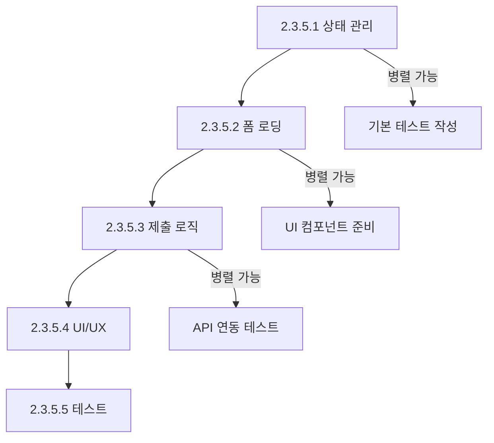

# Story 2.3.5 실행 계획: 반복 일정 단일 수정 시 폼 데이터 정확 반영

## 개요

Story 2.3.5를 5개의 세분화된 실행 가능한 스토리로 분해하여 체계적인 구현을 진행합니다.

## 세분화된 스토리 목록

### 🔧 Story 2.3.5.1: 단일 수정 모드 상태 관리 개선

- **파일:** `2.3.5.1-single-edit-state-management.md`
- **목표:** `useEditingState` 훅에 `isSingleEdit` 플래그 추가
- **예상 시간:** 3-5시간
- **상태:** Ready for Development

**핵심 작업:**

- `useEditingState` 훅 확장
- `startSingleEdit` 함수 구현
- 타입 정의 업데이트
- 단위 테스트 작성

### 📝 Story 2.3.5.2: 폼 로딩 로직 개선

- **파일:** `2.3.5.2-form-loading-logic-fix.md`
- **목표:** 단일 수정 시 원본 반복 정보가 폼에 표시되도록 개선
- **예상 시간:** 4-5시간
- **상태:** Ready for Development
- **의존성:** Story 2.3.5.1 완료 필요

**핵심 작업:**

- `handleEditRecurringEvent`에서 `convertToSingleEvent` 호출 제거
- 원본 데이터로 폼 로딩
- 단일 수정 플래그 설정
- 폼 상태 초기화 로직 확인

### 💾 Story 2.3.5.3: 제출 로직 개선

- **파일:** `2.3.5.3-submit-logic-improvement.md`
- **목표:** 제출 시점에만 단일 일정으로 전환하는 로직 구현
- **예상 시간:** 5-7시간
- **상태:** Ready for Development
- **의존성:** Story 2.3.5.1, 2.3.5.2 완료 필요

**핵심 작업:**

- `addOrUpdateEvent` 함수에서 모드별 분기 처리
- 단일 수정 시 `convertToSingleEvent` 호출
- 반복 배치 생성 로직과 분리
- 상태 정리 로직 개선

### 🎨 Story 2.3.5.4: UI/UX 개선

- **파일:** `2.3.5.4-ui-ux-enhancement.md`
- **목표:** 단일 수정 모드임을 명확히 알려주는 UI 개선
- **예상 시간:** 6-8시간
- **상태:** Ready for Development
- **의존성:** Story 2.3.5.1~2.3.5.3 완료 필요

**핵심 작업:**

- 단일 수정 모드 안내 메시지 추가
- 반복 설정 필드 시각적 구분
- 저장 버튼 텍스트 변경
- 모드별 성공/에러 메시지 구현

### 🧪 Story 2.3.5.5: 종합 테스트

- **파일:** `2.3.5.5-comprehensive-testing.md`
- **목표:** 모든 시나리오에 대한 포괄적인 테스트 구현
- **예상 시간:** 17-24시간
- **상태:** Ready for Development
- **의존성:** Story 2.3.5.1~2.3.5.4 완료 필요

**핵심 작업:**

- 단위 테스트, 컴포넌트 테스트 작성
- 통합 테스트 및 E2E 테스트
- 에러 시나리오 및 성능 테스트
- 95% 이상 코드 커버리지 달성

## 실행 순서

## 전체 예상 시간

| 스토리   | 개발 시간     | 테스트 시간  | 총 시간       |
| -------- | ------------- | ------------ | ------------- |
| 2.3.5.1  | 2-3시간       | 1-2시간      | 3-5시간       |
| 2.3.5.2  | 2-3시간       | 2시간        | 4-5시간       |
| 2.3.5.3  | 3-4시간       | 2-3시간      | 5-7시간       |
| 2.3.5.4  | 3-4시간       | 3-4시간      | 6-8시간       |
| 2.3.5.5  | 17-24시간     | -            | 17-24시간     |
| **총계** | **27-38시간** | **8-11시간** | **35-49시간** |

## 성공 기준

### 기능적 기준

- [ ] 반복 일정 단일 수정 시 원본 반복 정보가 폼에 표시됨
- [ ] 반복 체크박스가 체크된 상태로 표시됨
- [ ] 반복 설정 필드들(유형, 간격, 종료일)이 보임
- [ ] 저장 시에만 단일 일정으로 전환됨
- [ ] 사용자가 반복 설정을 수정하거나 해제할 수 있음

### 기술적 기준

- [ ] 기존 편집 로직에 영향 없음
- [ ] 타입 안전성 보장
- [ ] 95% 이상 테스트 커버리지
- [ ] 성능 저하 없음

### 사용자 경험 기준

- [ ] 모드별 명확한 안내 메시지
- [ ] 직관적인 UI/UX
- [ ] 적절한 피드백 및 에러 메시지
- [ ] 접근성 기준 만족

## 위험 요소 및 완화 방안

### 위험 요소

1. **복잡한 상태 관리** - 기존 로직과의 충돌 가능성
2. **UI/UX 복잡성** - 사용자 혼란 가능성
3. **테스트 복잡성** - 다양한 시나리오 커버 어려움

### 완화 방안

1. **점진적 구현** - 작은 단위로 나누어 검증하며 진행
2. **명확한 문서화** - 각 단계별 상세 설명 및 테스트 케이스
3. **충분한 테스트** - 단위/통합/E2E 테스트로 안정성 확보

## 참고 사항

- 모든 스토리는 독립적으로 검토 및 테스트 가능
- 각 스토리는 명확한 Definition of Done을 가짐
- 병렬 작업이 가능한 부분은 팀 역량에 따라 조정
- 예상 시간은 1명의 개발자 기준이며, 팀 규모에 따라 조정 가능

## 다음 단계

1. **팀 리뷰** - 세분화된 스토리 검토 및 승인
2. **스프린트 계획** - 팀 역량과 우선순위에 따른 스프린트 배정
3. **개발 시작** - Story 2.3.5.1부터 순차적 구현 시작
