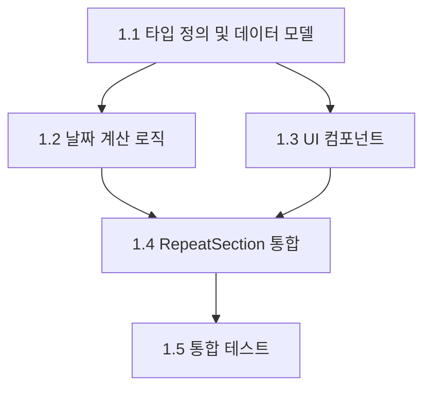

# 에픽 6: 주간 반복 요일 선택 기능

## 에픽 개요

**에픽 목표**: 사용자가 주간 반복 일정 생성 시 특정 요일들을 선택할 수 있는 기능을 추가하여, 더 유연하고 정밀한 반복 일정 관리를 제공합니다.

**통합 요구사항**: 기존 RepeatInfo 구조와 반복 일정 계산 로직을 확장하되, 하위 호환성을 완전히 보장하여 기존 기능에 영향을 주지 않습니다.

## 비즈니스 가치

### 사용자 혜택

- "매주 월, 수, 금요일에 운동" 같은 복잡한 반복 패턴 설정 가능
- 기존 단순 주간 반복보다 정밀한 일정 관리
- 직관적인 요일 선택 UI로 사용성 향상

### 기술적 가치

- 기존 시스템과의 완전한 호환성 유지
- 확장 가능한 구조로 향후 월간 옵션 등 추가 기능 지원
- 선언적 컴포넌트 구조로 유지보수성 향상

## 기술적 제약사항

### 호환성 요구사항

- 기존 RepeatInfo API와 완전 호환
- weeklyOptions는 선택적 필드로 추가
- 기존 데이터베이스 스키마 변경 없이 JSON 필드 내 저장
- Material-UI 디자인 시스템과 완전 일치

### 성능 요구사항

- 기존 반복 일정 계산 성능 유지
- 요일 선택 기능 추가로 인한 성능 저하 20% 이하
- TypeScript 타입 안정성 유지 (any 타입 금지)

## 스토리 구조

### 스토리 우선순위 및 의존성

---

## 스토리 1.1: 타입 정의 및 데이터 모델 확장

**As a** 개발자  
**I want** RepeatInfo 타입에 weeklyOptions 필드를 추가하고 관련 타입을 정의할 수 있다  
**So that** 주간 반복 요일 선택 기능의 기반 데이터 구조를 구축할 수 있다

### 수락 기준

1. ✅ WeeklyOptions 인터페이스가 daysOfWeek: number[] 필드를 포함하여 정의된다
2. ✅ RepeatInfo 타입에 weeklyOptions?: WeeklyOptions 옵셔널 필드가 추가된다
3. ✅ 기존 RepeatInfo 객체들이 수정 없이 정상 동작한다
4. ✅ TypeScript 컴파일 오류가 발생하지 않는다

### 통합 검증

- **IV1**: 기존 반복 일정 생성 기능이 weeklyOptions 없이 정상 동작함을 확인
- **IV2**: 새로운 타입 정의가 기존 코드와 충돌하지 않음을 확인
- **IV3**: 타입 추가로 인한 성능 영향이 없음을 확인

### 구현 세부사항

- `src/types.ts`에 WeeklyOptions 인터페이스 추가
- RepeatInfo 인터페이스에 weeklyOptions 옵셔널 필드 추가
- 요일은 0(일요일)부터 6(토요일)까지 숫자 배열로 관리

---

## 스토리 1.2: 주간 요일별 날짜 계산 로직 구현

**As a** 개발자  
**I want** 선택된 요일들만 포함하는 주간 반복 날짜를 계산할 수 있다  
**So that** 사용자가 선택한 특정 요일에만 일정이 생성될 수 있다

### 수락 기준

1. ✅ calculateWeeklyWithSpecificDays 함수가 구현되어 선택된 요일만 계산한다
2. ✅ calculateRecurringDatesWithOptions 함수가 weeklyOptions 지원을 추가한다
3. ✅ 기존 calculateRecurringDates 함수는 변경 없이 유지된다
4. ✅ 단위 테스트가 모든 요일 조합에 대해 통과한다

### 통합 검증

- **IV1**: 기존 주간 반복 계산이 weeklyOptions 없이 기존 방식대로 동작함을 확인
- **IV2**: 새로운 계산 로직이 기존 성능 특성을 유지함을 확인
- **IV3**: 다양한 요일 조합에서 정확한 날짜가 계산됨을 확인

### 구현 세부사항

- `src/utils/recurringUtils.ts`에 새로운 계산 함수 추가
- 기존 함수와 별도로 구현하여 하위 호환성 보장
- TDD 방식으로 단위 테스트 먼저 작성

---

## 스토리 1.3: WeeklyDaysSelector UI 컴포넌트 개발

**As a** 사용자  
**I want** 주간 반복 선택 시 원하는 요일들을 체크박스로 선택할 수 있다  
**So that** 내가 원하는 특정 요일에만 반복 일정을 만들 수 있다

### 수락 기준

1. ✅ WeeklyDaysSelector 컴포넌트가 7개 요일 체크박스를 제공한다
2. ✅ 체크박스는 일, 월, 화, 수, 목, 금, 토 순서로 한국어로 표시된다
3. ✅ 최소 1개 요일 선택 검증이 구현된다
4. ✅ Material-UI FormGroup과 Checkbox를 사용한다
5. ✅ 키보드 네비게이션과 스크린 리더를 지원한다

### 통합 검증

- **IV1**: 기존 RepeatSection UI 스타일과 일관성이 유지됨을 확인
- **IV2**: 모바일과 데스크톱에서 반응형 레이아웃이 정상 동작함을 확인
- **IV3**: 접근성 기준(WCAG 2.1 AA)을 충족함을 확인

### 구현 세부사항

- `src/components/WeeklyDaysSelector.tsx` 신규 생성
- Material-UI FormGroup, FormLabel, Checkbox 컴포넌트 활용
- 선언적 구조로 재사용성과 테스트 가능성 확보

---

## 스토리 1.4: RepeatSection 컴포넌트 통합 및 상태 관리

**As a** 사용자  
**I want** 반복 타입을 주간으로 선택하면 자동으로 요일 선택 UI가 나타난다  
**So that** 직관적으로 주간 반복 요일을 설정할 수 있다

### 수락 기준

1. ✅ repeatType이 'weekly'일 때 WeeklyDaysSelector가 조건부 렌더링된다
2. ✅ 반복 타입 변경 시 weeklyOptions 상태가 적절히 초기화된다
3. ✅ 폼 제출 시 weeklyOptions가 RepeatInfo에 포함된다
4. ✅ 기존 RepeatSection의 레이아웃과 스타일이 유지된다

### 통합 검증

- **IV1**: 기존 반복 설정 플로우가 변경 없이 동작함을 확인
- **IV2**: 주간 이외 반복 타입 선택 시 요일 선택 UI가 표시되지 않음을 확인
- **IV3**: 폼 상태 관리가 기존 패턴과 일관성을 유지함을 확인

### 구현 세부사항

- `src/components/RepeatSection.tsx` 수정
- 조건부 렌더링으로 WeeklyDaysSelector 통합
- 기존 스타일과 레이아웃 패턴 유지

---

## 스토리 1.5: 통합 테스트 및 기존 기능 검증

**As a** QA 엔지니어  
**I want** 새로운 주간 요일 선택 기능이 기존 반복 일정 기능과 완벽히 호환된다  
**So that** 기존 사용자의 일정이 영향받지 않고 새로운 기능을 안전하게 제공할 수 있다

### 수락 기준

1. ✅ 기존 반복 일정(weeklyOptions 없음)이 정상 동작한다
2. ✅ 새로운 요일 선택 기능이 모든 시나리오에서 정확히 동작한다
3. ✅ E2E 테스트가 전체 사용자 플로우를 검증한다
4. ✅ 성능 테스트가 NFR1 기준(20% 이하 성능 저하)을 충족한다

### 통합 검증

- **IV1**: 기존 사용자 데이터와 일정이 마이그레이션 없이 정상 동작함을 확인
- **IV2**: 새로운 기능과 기존 기능 간 상호작용에서 충돌이 없음을 확인
- **IV3**: 전체 애플리케이션의 안정성과 성능이 유지됨을 확인

### 구현 세부사항

- 기존 테스트에 weeklyOptions 케이스 추가
- 새로운 통합 테스트 및 E2E 테스트 작성
- 성능 회귀 테스트 수행

## 완료 기준 (Definition of Done)

### 기능적 요구사항

- [ ] 모든 스토리의 수락 기준이 충족됨
- [ ] 모든 통합 검증이 통과됨
- [ ] 사용자 시나리오가 E2E 테스트로 검증됨

### 비기능적 요구사항

- [ ] 성능 저하 20% 이하 유지
- [ ] WCAG 2.1 AA 접근성 기준 충족
- [ ] Material-UI 디자인 시스템 일관성 유지
- [ ] TypeScript 타입 안정성 유지 (any 타입 없음)

### 품질 기준

- [ ] 단위 테스트 커버리지 90% 이상
- [ ] 통합 테스트 모든 케이스 통과
- [ ] E2E 테스트 주요 플로우 검증
- [ ] 코드 리뷰 승인 완료

### 배포 준비

- [ ] 문서 업데이트 완료
- [ ] 하위 호환성 검증 완료
- [ ] 롤백 계획 수립 완료

---

이 에픽은 기존 시스템의 무결성을 유지하면서 주간 반복 요일 선택 기능을 안전하게 추가하는 로드맵을 제공합니다. 각 스토리는 점진적으로 기능을 구축하며, 기존 기능에 대한 위험을 최소화하는 순서로 설계되었습니다.
